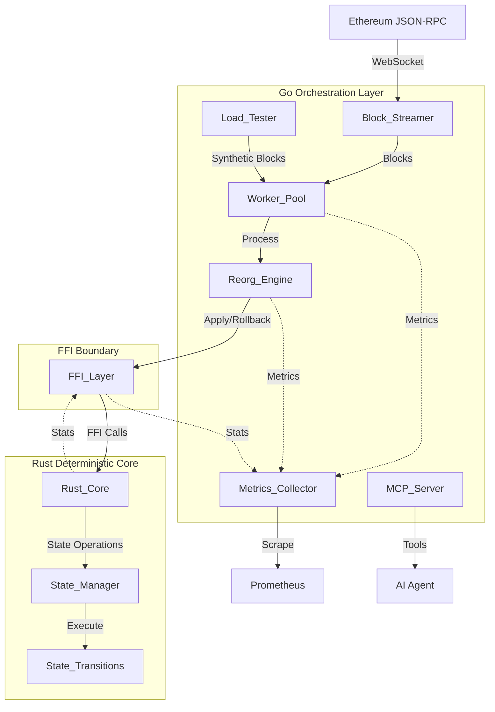

# Design Document: Hybrid Runtime Blockchain Engine

## Overview

The Hybrid Runtime Blockchain Engine is a production-grade blockchain event processing system that combines a Go orchestration layer with a Rust deterministic core to achieve high-performance, reorg-safe blockchain event processing. The system connects to Ethereum JSON-RPC, streams blocks, detects chain reorganizations, processes state transitions deterministically, and exposes observability through Prometheus metrics and MCP (Model Context Protocol) tools.

### Design Goals

1. **Deterministic State Transitions**: Guarantee reproducible state given identical block sequences
2. **Reorg Safety**: Detect and handle blockchain reorganizations with automatic rollback and replay
3. **High Performance**: Process thousands of transactions per second with minimal latency
4. **Observability**: Expose comprehensive metrics and AI-driven introspection tools
5. **Memory Safety**: Prevent memory leaks and corruption across the FFI boundary
6. **Production Readiness**: Include graceful shutdown, structured logging, and comprehensive testing

### Why Hybrid Runtime?

The architecture combines two runtime models to leverage their complementary strengths:

- **Go (GC Runtime)**: Handles I/O-bound operations (WebSocket connections, HTTP servers), concurrent orchestration (worker pools, channels), and provides excellent tooling for observability
- **Rust (No-GC Runtime)**: Provides deterministic execution for state transitions, predictable latency without GC pauses, and memory safety guarantees

This separation ensures that garbage collection pauses in Go do not affect the deterministic execution of state transitions in Rust, while Go's concurrency primitives efficiently orchestrate the overall system.

## Architecture

### High-Level Architecture



### Component Responsibilities

| Component | Runtime | Responsibility |
|-----------|---------|----------------|
| Block_Streamer | Go | WebSocket connection to Ethereum, block retrieval, connection retry logic |
| Worker_Pool | Go | Concurrent block processing, backpressure management, panic recovery |
| Reorg_Engine | Go | Reorg detection via ring buffer, fork point identification, rollback coordination |
| Rust_Core | Rust | Deterministic state transitions, state root calculation, rollback execution |
| FFI_Layer | Go/Rust | Memory-safe data marshaling, input validation, error handling |
| Metrics_Collector | Go | Prometheus metrics exposition, health endpoints, debug endpoints |
| MCP_Server | Go | Model Context Protocol tools for AI introspection |
| Load_Tester | Go | Synthetic block generation, benchmark execution, performance reporting |

### Data Flow

1. **Normal Block Processing**:
   - Block_Streamer receives block from Ethereum
   - Block forwarded to Worker_Pool via bounded channel
   - Worker goroutine serializes block and calls FFI
   - Rust_Core applies state transitions deterministically
   - State_Root updated and returned to Go
   - Metrics updated

2. **Reorg Detection and Rollback**:
   - Reorg_Engine detects parent hash mismatch
   - Fork_Point identified by traversing ring buffer
   - Rust_Core rollback_to called with Fork_Point block number
   - New canonical blocks replayed from Fork_Point + 1
   - Reorg metrics recorded

3. **MCP Introspection**:
   - AI agent calls MCP tool (e.g., get_state_root)
   - MCP_Server validates request and rate limits
   - Tool implementation calls FFI or queries Go runtime
   - Results formatted as JSON and returned

## Components and Interfaces

### Block_Streamer

**Purpose**: Establish and maintain WebSocket connection to Ethereum JSON-RPC, stream blocks in real-time.

**Interface**:
```go
type BlockStreamer interface {
    Start(ctx context.Context, rpcURL string) error
    Blocks() <-chan Block
    Stop() error
}

type Block struct {
    Number      uint64
    ParentHash  [32]byte
    Timestamp   uint64
    Transactions []Transaction
}

type Transaction struct {
    From   [20]byte
    To     [20]byte
    Value  *big.Int
    Data   []byte
}
```

**Behavior**:
- Establishes WebSocket connection on Start()
- Subscribes to newHeads and retrieves full block data
- Validates block number and parent hash before forwarding
- Implements exponential backoff retry (5 attempts, 30s timeout)
- Closes channel and cleans up on Stop()

**Error Handling**:
- Connection failures trigger retry with exponential backoff
- Timeout after 30 seconds logs error and terminates attempt
- Invalid blocks logged and skipped
- Graceful shutdown on context cancellation

### Worker_Pool

**Purpose**: Manage concurrent block processing with backpressure and panic recovery.

**Interface**:
```go
type WorkerPool interface {
    Start(ctx context.Context, numWorkers int) error
    Submit(block Block) error
    Stop() error
    ActiveWorkers() int
}
```

**Configuration**:
- Worker count: 1-256 (configurable via environment variable)
- Bounded channel size: 2x worker count
- Panic recovery: automatic worker restart

**Behavior**:
- Spawns numWorkers goroutines on Start()
- Each worker reads from bounded channel and processes blocks
- Submit() blocks when channel is full (backpressure)
- Panic recovery logs error, increments panic metric, restarts worker
- Stop() drains channel and waits for workers (30s timeout)

**Metrics**:
- worker_active_count (gauge)
- worker_queue_depth (gauge)
- worker_utilization_percent (gauge)
- worker_panic_total (counter)

### Reorg_Engine

**Purpose**: Detect blockchain reorganizations and coordinate rollback/replay.

**Interface**:
```go
type ReorgEngine interface {
    ProcessBlock(block Block) error
    DetectReorg(block Block) (bool, uint64, error)
    Rollback(forkPoint uint64) error
}

type RingBuffer struct {
    blocks [10]Block
    index  int
}
```

**Algorithm**:

1. **Reorg Detection**:
```
function DetectReorg(newBlock):
    if ringBuffer.isEmpty():
        return false, 0
    
    prevBlock = ringBuffer.latest()
    if newBlock.ParentHash != prevBlock.Hash():
        // Potential reorg detected
        forkPoint = findForkPoint(newBlock)
        if forkPoint == NOT_FOUND:
            return error("reorg depth exceeds buffer")
        return true, forkPoint
    
    return false, 0

function findForkPoint(newBlock):
    for i = ringBuffer.size - 1 down to 0:
        if ringBuffer[i].Hash() == newBlock.ParentHash:
            return ringBuffer[i].Number
    return NOT_FOUND
```

2. **Rollback and Replay**:
```
function Rollback(forkPoint):
    // Call Rust FFI to rollback state
    result = rust_rollback_to(forkPoint)
    if result != SUCCESS:
        return error
    
    // Clear ring buffer entries after fork point
    ringBuffer.truncate(forkPoint)
    
    return SUCCESS
```

**Metrics**:
- reorg_total (counter)
- reorg_depth_blocks (histogram)
- reorg_rollback_duration_seconds (histogram)

### Rust_Core

**Purpose**: Execute deterministic state transitions without GC interference.

**State Model**:
```rust
pub struct StateEngine {
    state: HashMap<Address, Account>,
    block_number: u64,
    state_root: [u8; 32],
    history: Vec<StateSnapshot>,
}

pub struct Account {
    balance: U256,
    nonce: u64,
}

pub struct StateSnapshot {
    block_number: u64,
    state: HashMap<Address, Account>,
    state_root: [u8; 32],
}
```

**Core Functions**:
```rust
#[no_mangle]
pub extern "C" fn init_engine() -> i32 {
    // Initialize state engine
    // Returns: 0 = success, -1 = error
}

#[no_mangle]
pub extern "C" fn apply_block(
    data_ptr: *const u8,
    data_len: usize,
    result_ptr: *mut u8,
    result_len: *mut usize
) -> i32 {
    // Apply block state transitions
    // Returns: 0 = success, -1 = error
}

#[no_mangle]
pub extern "C" fn rollback_to(block_number: u64) -> i32 {
    // Rollback state to specified block
    // Returns: 0 = success, -1 = error
}

#[no_mangle]
pub extern "C" fn get_state_root(
    root_ptr: *mut u8,
    root_len: *mut usize
) -> i32 {
    // Get current state root hash
    // Returns: 0 = success, -1 = error
}

#[no_mangle]
pub extern "C" fn get_stats(
    stats_ptr: *mut u8,
    stats_len: *mut usize
) -> i32 {
    // Get memory and performance stats
    // Returns: 0 = success, -1 = error
}

#[no_mangle]
pub extern "C" fn free_buffer(ptr: *mut u8, len: usize) {
    // Free Rust-allocated memory
}
```

**Determinism Guarantees**:
- No global mutable state
- No system time calls (SystemTime::now)
- No random number generation
- Deterministic hash function (Blake3)
- Sequential block processing by block number
- No floating-point arithmetic

**State Transition Logic**:
```rust
fn apply_block_internal(block: &Block) -> Result<[u8; 32], Error> {
    for tx in &block.transactions {
        // Validate transaction
        if !validate_transaction(tx) {
            continue;
        }
        
        // Update sender balance
        let sender = state.get_mut(&tx.from)?;
        sender.balance = sender.balance.checked_sub(tx.value)?;
        sender.nonce += 1;
        
        // Update receiver balance
        let receiver = state.get_mut(&tx.to)?;
        receiver.balance = receiver.balance.checked_add(tx.value)?;
    }
    
    // Calculate state root
    let state_root = calculate_state_root(&state);
    
    // Save snapshot for rollback
    history.push(StateSnapshot {
        block_number: block.number,
        state: state.clone(),
        state_root,
    });
    
    Ok(state_root)
}
```

### FFI_Layer

**Purpose**: Provide memory-safe boundary between Go and Rust with validation.

**Memory Management Rules**:
1. Go allocates memory for input data, Rust reads it
2. Rust allocates memory for output data, Go reads it and calls free_buffer
3. No Go pointers stored in Rust memory
4. All pointers validated for null before dereferencing
5. All lengths validated (0 to 10MB)

**Serialization Protocol**:
```
Block Serialization Format (binary):
[Version: 1 byte]
[Block Number: 8 bytes, big-endian]
[Parent Hash: 32 bytes]
[Timestamp: 8 bytes, big-endian]
[Tx Count: 4 bytes, big-endian]
[Transactions: variable length]

Transaction Format:
[From: 20 bytes]
[To: 20 bytes]
[Value: 32 bytes, big-endian U256]
[Data Length: 4 bytes, big-endian]
[Data: variable length]
```

**Go FFI Wrapper**:
```go
package ffi

/*
#cgo LDFLAGS: -L./target/release -lrust_core
#include <stdlib.h>

extern int init_engine();
extern int apply_block(const unsigned char* data, size_t len, 
                       unsigned char** result, size_t* result_len);
extern int rollback_to(unsigned long long block_number);
extern int get_state_root(unsigned char** root, size_t* root_len);
extern int get_stats(unsigned char** stats, size_t* stats_len);
extern void free_buffer(unsigned char* ptr, size_t len);
*/
import "C"

type FFI struct{}

func (f *FFI) ApplyBlock(block Block) ([32]byte, error) {
    // Serialize block
    data, err := serializeBlock(block)
    if err != nil {
        return [32]byte{}, err
    }
    
    // Validate input
    if len(data) > 10*1024*1024 {
        return [32]byte{}, errors.New("block too large")
    }
    
    // Call Rust
    var resultPtr *C.uchar
    var resultLen C.size_t
    
    ret := C.apply_block(
        (*C.uchar)(unsafe.Pointer(&data[0])),
        C.size_t(len(data)),
        &resultPtr,
        &resultLen,
    )
    
    if ret != 0 {
        return [32]byte{}, errors.New("apply_block failed")
    }
    
    // Copy result and free Rust memory
    defer C.free_buffer(resultPtr, resultLen)
    
    var stateRoot [32]byte
    copy(stateRoot[:], C.GoBytes(unsafe.Pointer(resultPtr), C.int(resultLen)))
    
    return stateRoot, nil
}
```

**Input Validation**:
- Null pointer checks
- Length bounds (0 to 10MB)
- Version byte validation
- Block number monotonicity
- Parent hash length (exactly 32 bytes)
- Serialization format validation

**Error Codes**:
- 0: Success
- -1: Invalid input
- -2: Serialization error
- -3: State error
- -4: Memory allocation error

### Metrics_Collector

**Purpose**: Expose Prometheus metrics and health/debug endpoints.

**HTTP Endpoints**:
- `GET /metrics` - Prometheus metrics (port 9090)
- `GET /health` - Health check (200 = healthy, 503 = unhealthy)
- `GET /debug/gc` - Go GC statistics (JSON)
- `GET /debug/state` - Current state root and size (JSON)

**Metrics**:
```go
// Go Runtime Metrics
gc_pause_seconds (histogram)
memory_alloc_bytes (gauge)
goroutine_count (gauge)

// Worker Pool Metrics
worker_active_count (gauge)
worker_queue_depth (gauge)
worker_utilization_percent (gauge)
worker_panic_total (counter)

// Rust Core Metrics
rust_apply_block_duration_seconds (histogram)
rust_state_size_entries (gauge)
rust_memory_usage_bytes (gauge)

// Reorg Metrics
reorg_total (counter)
reorg_depth_blocks (histogram)
reorg_rollback_duration_seconds (histogram)

// Block Processing Metrics
blocks_processed_total (counter)
block_processing_duration_seconds (histogram)
```

**Health Check Logic**:
```go
func (m *MetricsCollector) Health() int {
    if !blockStreamer.IsConnected() {
        return 503
    }
    if workerPool.ActiveWorkers() == 0 {
        return 503
    }
    return 200
}
```

### MCP_Server

**Purpose**: Expose Model Context Protocol tools for AI-driven introspection.

**Tool Specifications**:

1. **get_gc_stats**
```json
{
  "name": "get_gc_stats",
  "description": "Returns Go garbage collection statistics",
  "inputSchema": {
    "type": "object",
    "properties": {}
  },
  "outputSchema": {
    "type": "object",
    "properties": {
      "num_gc": {"type": "integer"},
      "pause_total_ns": {"type": "integer"},
      "pause_ns": {"type": "array", "items": {"type": "integer"}},
      "last_gc": {"type": "string"}
    }
  }
}
```

2. **get_heap_usage**
```json
{
  "name": "get_heap_usage",
  "description": "Returns current heap memory usage",
  "inputSchema": {
    "type": "object",
    "properties": {}
  },
  "outputSchema": {
    "type": "object",
    "properties": {
      "alloc_bytes": {"type": "integer"},
      "total_alloc_bytes": {"type": "integer"},
      "sys_bytes": {"type": "integer"},
      "heap_objects": {"type": "integer"}
    }
  }
}
```

3. **get_goroutine_count**
```json
{
  "name": "get_goroutine_count",
  "description": "Returns the number of active goroutines",
  "inputSchema": {
    "type": "object",
    "properties": {}
  },
  "outputSchema": {
    "type": "object",
    "properties": {
      "count": {"type": "integer"}
    }
  }
}
```

4. **get_latency_distribution**
```json
{
  "name": "get_latency_distribution",
  "description": "Returns block processing latency percentiles",
  "inputSchema": {
    "type": "object",
    "properties": {}
  },
  "outputSchema": {
    "type": "object",
    "properties": {
      "p50_ms": {"type": "number"},
      "p95_ms": {"type": "number"},
      "p99_ms": {"type": "number"},
      "max_ms": {"type": "number"}
    }
  }
}
```

5. **get_reorg_history**
```json
{
  "name": "get_reorg_history",
  "description": "Returns recent reorg events with depth and timestamp",
  "inputSchema": {
    "type": "object",
    "properties": {
      "limit": {"type": "integer", "default": 10}
    }
  },
  "outputSchema": {
    "type": "object",
    "properties": {
      "reorgs": {
        "type": "array",
        "items": {
          "type": "object",
          "properties": {
            "timestamp": {"type": "string"},
            "fork_point": {"type": "integer"},
            "depth": {"type": "integer"},
            "rollback_duration_ms": {"type": "number"}
          }
        }
      }
    }
  }
}
```

6. **get_state_root**
```json
{
  "name": "get_state_root",
  "description": "Returns the current state root hash",
  "inputSchema": {
    "type": "object",
    "properties": {}
  },
  "outputSchema": {
    "type": "object",
    "properties": {
      "state_root": {"type": "string"},
      "block_number": {"type": "integer"}
    }
  }
}
```

7. **get_state_size**
```json
{
  "name": "get_state_size",
  "description": "Returns the number of state entries and memory usage",
  "inputSchema": {
    "type": "object",
    "properties": {}
  },
  "outputSchema": {
    "type": "object",
    "properties": {
      "entry_count": {"type": "integer"},
      "memory_bytes": {"type": "integer"}
    }
  }
}
```

8. **get_apply_block_latency**
```json
{
  "name": "get_apply_block_latency",
  "description": "Returns recent apply_block execution times",
  "inputSchema": {
    "type": "object",
    "properties": {
      "limit": {"type": "integer", "default": 100}
    }
  },
  "outputSchema": {
    "type": "object",
    "properties": {
      "latencies_ms": {"type": "array", "items": {"type": "number"}},
      "mean_ms": {"type": "number"},
      "stddev_ms": {"type": "number"}
    }
  }
}
```

9. **validate_determinism**
```json
{
  "name": "validate_determinism",
  "description": "Reapplies recent blocks and verifies state root consistency",
  "inputSchema": {
    "type": "object",
    "properties": {
      "block_count": {"type": "integer", "default": 10}
    }
  },
  "outputSchema": {
    "type": "object",
    "properties": {
      "consistent": {"type": "boolean"},
      "blocks_checked": {"type": "integer"},
      "error": {"type": "string"}
    }
  }
}
```

10. **run_load_test**
```json
{
  "name": "run_load_test",
  "description": "Runs a load test with specified TPS and duration",
  "inputSchema": {
    "type": "object",
    "properties": {
      "tps": {"type": "integer", "minimum": 1, "maximum": 10000},
      "duration_seconds": {"type": "integer", "minimum": 1, "maximum": 300}
    },
    "required": ["tps", "duration_seconds"]
  },
  "outputSchema": {
    "type": "object",
    "properties": {
      "p50_latency_ms": {"type": "number"},
      "p99_latency_ms": {"type": "number"},
      "throughput_tps": {"type": "number"},
      "error_count": {"type": "integer"}
    }
  }
}
```

11. **compare_gc_vs_core_latency**
```json
{
  "name": "compare_gc_vs_core_latency",
  "description": "Returns latency variance comparison between GC and core",
  "inputSchema": {
    "type": "object",
    "properties": {}
  },
  "outputSchema": {
    "type": "object",
    "properties": {
      "go_latency_variance_ms": {"type": "number"},
      "rust_latency_variance_ms": {"type": "number"},
      "variance_ratio": {"type": "number"}
    }
  }
}
```

**Security Controls**:
- Bind to localhost (127.0.0.1) only
- Rate limit: 10 requests per minute per tool
- Input validation against schema
- No shell command execution
- JSON-only responses
- HTTP 429 on rate limit exceeded

### Load_Tester

**Purpose**: Generate synthetic blocks and measure performance.

**Simulation Modes**:
- 1000 TPS
- 5000 TPS
- 10000 TPS

**Synthetic Block Generation**:
```go
func (lt *LoadTester) GenerateBlock(seed int64, txCount int) Block {
    rng := rand.New(rand.NewSource(seed))
    
    txs := make([]Transaction, txCount)
    for i := 0; i < txCount; i++ {
        txs[i] = Transaction{
            From:  randomAddress(rng),
            To:    randomAddress(rng),
            Value: randomValue(rng),
            Data:  []byte{},
        }
    }
    
    return Block{
        Number:       uint64(seed),
        ParentHash:   randomHash(rng),
        Timestamp:    uint64(time.Now().Unix()),
        Transactions: txs,
    }
}
```

**Benchmark Measurements**:
- p50 latency (median)
- p99 latency (99th percentile)
- Throughput (blocks/second)
- GC pause time during test
- Memory growth rate
- Reorg rollback cost

**Benchmark Report Format**:
```json
{
  "timestamp": "2024-01-15T10:30:00Z",
  "config": {
    "tps": 5000,
    "duration_seconds": 60,
    "worker_count": 8
  },
  "results": {
    "p50_latency_ms": 2.5,
    "p99_latency_ms": 8.3,
    "throughput_tps": 4950,
    "error_count": 0
  },
  "gc_metrics": {
    "total_pause_ms": 150,
    "max_pause_ms": 12,
    "num_gc": 45
  },
  "rust_metrics": {
    "mean_latency_ms": 1.2,
    "latency_variance_ms": 0.3
  },
  "memory": {
    "start_mb": 50,
    "end_mb": 120,
    "growth_rate_mb_per_sec": 1.17
  },
  "reorg_cost": {
    "rollback_10_blocks_ms": 15,
    "replay_10_blocks_ms": 25
  }
}
```

## Data Models

### Block
```go
type Block struct {
    Number       uint64      // Block number
    ParentHash   [32]byte    // Parent block hash
    Timestamp    uint64      // Unix timestamp
    Transactions []Transaction
}
```

### Transaction
```go
type Transaction struct {
    From  [20]byte   // Sender address
    To    [20]byte   // Receiver address
    Value *big.Int   // Transfer amount
    Data  []byte     // Transaction data
}
```

### State (Rust)
```rust
pub struct StateEngine {
    state: HashMap<Address, Account>,
    block_number: u64,
    state_root: [u8; 32],
    history: Vec<StateSnapshot>,
}

pub struct Account {
    balance: U256,
    nonce: u64,
}

pub type Address = [u8; 20];
```

### Metrics
```go
type Metrics struct {
    // Go Runtime
    GCPauseSeconds       prometheus.Histogram
    MemoryAllocBytes     prometheus.Gauge
    GoroutineCount       prometheus.Gauge
    
    // Worker Pool
    WorkerActiveCount    prometheus.Gauge
    WorkerQueueDepth     prometheus.Gauge
    WorkerUtilization    prometheus.Gauge
    WorkerPanicTotal     prometheus.Counter
    
    // Rust Core
    RustApplyBlockDuration prometheus.Histogram
    RustStateSizeEntries   prometheus.Gauge
    RustMemoryUsageBytes   prometheus.Gauge
    
    // Reorg
    ReorgTotal             prometheus.Counter
    ReorgDepthBlocks       prometheus.Histogram
    ReorgRollbackDuration  prometheus.Histogram
    
    // Block Processing
    BlocksProcessedTotal   prometheus.Counter
    BlockProcessingDuration prometheus.Histogram
}
```

### Configuration
```go
type Config struct {
    // Ethereum
    RPCURL string // Environment: ETH_RPC_URL
    
    // Worker Pool
    WorkerCount int // Environment: WORKER_COUNT (default: 4)
    
    // Metrics
    MetricsPort int // Environment: METRICS_PORT (default: 9090)
    
    // MCP Server
    MCPPort int // Environment: MCP_PORT (default: 8080)
    
    // Reorg
    ReorgBufferSize int // Fixed: 10
    MaxReorgDepth   int // Fixed: 10
    
    // Load Testing
    LoadTestEnabled bool // Environment: LOAD_TEST_ENABLED (default: false)
}
```


## Correctness Properties

*A property is a characteristic or behavior that should hold true across all valid executions of a system-essentially, a formal statement about what the system should do. Properties serve as the bridge between human-readable specifications and machine-verifiable correctness guarantees.*

### Property Reflection

After analyzing all acceptance criteria, I identified the following redundancies and consolidations:

**Metric Properties Consolidation**: Requirements 10.2-10.7 all test that specific metrics exist and are updated. These can be consolidated into a single property that verifies all metrics are properly tracked.

**MCP Tool Properties Consolidation**: Requirements 12.1-12.5, 13.1-13.3, and 14.4 all test that MCP tools exist and return valid JSON. These can be consolidated into a single property about tool availability and response format.

**Benchmark Report Properties Consolidation**: Requirements 17.2-17.6 all test that the benchmark report contains specific fields. These can be consolidated into a single property about report completeness.

**Configuration Properties Consolidation**: Requirements 20.1-20.4 all test configuration loading. These can be consolidated into a single example test.

**FFI Validation Properties**: Requirements 7.1, 7.2, 23.2, and 23.3 all test FFI input validation. These can be consolidated into a comprehensive validation property.

**Determinism Properties**: Requirements 5.2 and 5.3 both test determinism. Requirement 5.3 subsumes 5.2 as it's the stronger guarantee.

**Rollback Properties**: Requirements 4.1, 4.2, and 5.5 all relate to rollback behavior. Requirement 5.5 (round-trip property) is the most comprehensive test.

### Property 1: Block Retrieval Completeness

*For any* block retrieved from Ethereum, the block data SHALL contain a valid block number, parent hash, timestamp, and transaction list.

**Validates: Requirements 1.2**

### Property 2: Connection Retry with Exponential Backoff

*For any* connection failure, the Block_Streamer SHALL retry with exponentially increasing delays up to 5 attempts.

**Validates: Requirements 1.3**

### Property 3: Block Validation Before Forwarding

*For any* block received, the Block_Streamer SHALL validate that it contains a valid block number and parent hash before forwarding to the Worker_Pool.

**Validates: Requirements 1.5**

### Property 4: Worker Pool Initialization Bounds

*For any* worker count between 1 and 256, the Worker_Pool SHALL successfully initialize with that number of workers.

**Validates: Requirements 2.1**

### Property 5: Block Dispatch to Workers

*For any* block received when the channel is not full, the Worker_Pool SHALL dispatch it to an available worker via the bounded channel.

**Validates: Requirements 2.2**

### Property 6: Panic Recovery and Worker Restart

*For any* panic-inducing input, the Worker_Pool SHALL recover from the panic, log the error, increment the panic metric, and restart the worker without terminating the process.

**Validates: Requirements 2.4, 24.1, 24.4, 24.5**

### Property 7: Worker Metrics Tracking

*For any* worker pool state, the system SHALL expose metrics for active worker count, queue depth, utilization percentage, and panic count.

**Validates: Requirements 2.5, 10.6, 10.7, 24.5**

### Property 8: Ring Buffer Size Invariant

*For any* sequence of blocks processed, the Reorg_Engine SHALL maintain a ring buffer containing at most the 10 most recent blocks.

**Validates: Requirements 3.1**

### Property 9: Reorg Detection on Parent Hash Mismatch

*For any* new block whose parent hash does not match the previous block's hash, the Reorg_Engine SHALL identify this as a potential reorg.

**Validates: Requirements 3.2**

### Property 10: Fork Point Identification

*For any* detected reorg, the Reorg_Engine SHALL traverse the ring buffer backwards to identify the fork point where the new chain diverges from the old chain.

**Validates: Requirements 3.3**

### Property 11: Reorg Depth Calculation

*For any* detected reorg, the Reorg_Engine SHALL calculate the reorg depth as the number of blocks between the fork point and the previous chain tip.

**Validates: Requirements 3.4**

### Property 12: Reorg Rollback and Replay

*For any* identified fork point, the Reorg_Engine SHALL invoke the Rust_Core rollback function with the fork point block number, then replay blocks from the new canonical chain starting at fork point plus one.

**Validates: Requirements 4.1, 4.2**

### Property 13: Reorg Metrics Recording

*For any* processed reorg, the system SHALL increment the reorg counter metric and record the reorg depth in a histogram metric.

**Validates: Requirements 4.3, 4.4, 10.5**

### Property 14: State Map Maintenance

*For any* block applied, the Rust_Core SHALL maintain an in-memory state map tracking account balances and update it according to the block's transactions.

**Validates: Requirements 5.1**

### Property 15: Deterministic State Transitions

*For any* identical block sequence applied multiple times, the Rust_Core SHALL produce identical State_Root values each time.

**Validates: Requirements 5.2, 5.3, 9.5**

### Property 16: Rollback-Replay Round Trip

*For any* valid block sequence, applying blocks then rolling back to a fork point then reapplying SHALL produce an equivalent State_Root (round-trip property).

**Validates: Requirements 5.5, 6.3**

### Property 17: FFI Apply Block Interface

*For any* valid serialized block, the apply_block FFI function SHALL accept the byte pointer and length, apply the block, and return a success code with the new State_Root.

**Validates: Requirements 6.2**

### Property 18: FFI Memory Deallocation

*For any* Rust-allocated memory returned to Go, calling free_buffer SHALL deallocate the memory without leaks.

**Validates: Requirements 6.6, 7.3**

### Property 19: FFI Input Validation

*For any* FFI call, the FFI_Layer SHALL validate that input pointers are non-null, input lengths are within bounds (0 to 10MB), block numbers are monotonically increasing, and parent hashes are exactly 32 bytes.

**Validates: Requirements 7.1, 7.2, 23.1, 23.2, 23.3**

### Property 20: FFI Error Handling Without Panics

*For any* error encountered in an FFI function, the FFI_Layer SHALL return an error code without panicking or crossing the FFI boundary with a panic.

**Validates: Requirements 7.5, 24.2, 24.3**

### Property 21: FFI Serialization Version Byte

*For any* block serialized by the FFI_Layer, the serialized data SHALL include a version byte as the first byte.

**Validates: Requirements 8.2**

### Property 22: FFI Version Validation

*For any* deserialization attempt, the FFI_Layer SHALL validate the version byte and reject unsupported versions with an error code.

**Validates: Requirements 8.3**

### Property 23: FFI Data Validation

*For any* serialized data received, the FFI_Layer SHALL validate that the data is well-formed before passing to the Rust_Core.

**Validates: Requirements 8.4**

### Property 24: FFI Serialization Error Handling

*For any* serialization failure, the FFI_Layer SHALL return a descriptive error code.

**Validates: Requirements 8.5, 23.4**

### Property 25: FFI Validation Failure Logging

*For any* validation failure in the FFI_Layer, the system SHALL log the failure with details of the invalid input.

**Validates: Requirements 23.5**

### Property 26: Prometheus Metrics Exposition

*For any* system state, the Metrics_Collector SHALL expose metrics for GC pause duration, memory allocation rate, Rust_Core apply_block latency, reorg count, worker queue depth, and worker utilization.

**Validates: Requirements 10.2, 10.3, 10.4, 10.5, 10.6, 10.7**

### Property 27: MCP Tool Response Format

*For any* valid MCP tool invocation, the MCP_Server SHALL return a JSON-formatted response without embedded executable code.

**Validates: Requirements 15.4**

### Property 28: MCP Determinism Validation

*For any* block sequence, the validate_determinism MCP tool SHALL reapply the blocks and verify that the State_Root remains consistent.

**Validates: Requirements 13.4**

### Property 29: MCP Rate Limiting

*For any* MCP tool, the MCP_Server SHALL rate-limit invocations to a maximum of 10 requests per minute per tool.

**Validates: Requirements 14.5**

### Property 30: MCP Security Input Validation

*For any* MCP tool invocation, the MCP_Server SHALL validate all input parameters against expected types and ranges, and reject any requests that attempt shell command execution.

**Validates: Requirements 15.2, 15.3**

### Property 31: Load Test Deterministic Block Generation

*For any* seed value, the Load_Tester SHALL generate deterministic synthetic transaction payloads that are identical across runs with the same seed.

**Validates: Requirements 16.2**

### Property 32: Load Test Metrics Collection

*For any* load test execution, the Load_Tester SHALL measure p50 latency, p99 latency, throughput, GC pause time, and memory growth rate.

**Validates: Requirements 16.3, 16.4, 16.5**

### Property 33: Load Test Result Export

*For any* completed load test, the Load_Tester SHALL export results as a JSON file containing GC vs Rust latency variance, throughput comparison, memory growth data, reorg rollback cost, timestamp, and test configuration.

**Validates: Requirements 17.1, 17.2, 17.3, 17.4, 17.5, 17.6**

### Property 34: Structured Log Format

*For any* log entry, the system SHALL include timestamp, log level, component name, and message in the log output.

**Validates: Requirements 19.2**

### Property 35: Configuration Validation

*For any* invalid configuration value, the system SHALL fail fast at startup with a descriptive error.

**Validates: Requirements 20.5**

### Property 36: Configuration Security Validation

*For any* configuration containing hardcoded secrets or credentials, the system SHALL reject the configuration and fail to start.

**Validates: Requirements 20.6**

## Error Handling

### Error Categories

1. **Transient Errors** (Recoverable):
   - WebSocket connection failures → Retry with exponential backoff
   - Worker panics → Recover, log, restart worker
   - Temporary network issues → Retry with backoff

2. **Validation Errors** (Rejectable):
   - Invalid block data → Log and skip block
   - FFI input validation failures → Return error code
   - MCP tool invalid parameters → Return HTTP 400

3. **Critical Errors** (Fatal):
   - Reorg depth exceeds buffer size → Log critical error and halt
   - Configuration validation failure → Fail fast at startup
   - Rust core initialization failure → Fail fast at startup

### Error Handling Strategies

**Block Streamer**:
```go
func (bs *BlockStreamer) connectWithRetry() error {
    backoff := time.Second
    for attempt := 1; attempt <= 5; attempt++ {
        conn, err := websocket.Dial(bs.rpcURL)
        if err == nil {
            bs.conn = conn
            return nil
        }
        
        log.Error("connection failed",
            zap.Int("attempt", attempt),
            zap.Error(err))
        
        if attempt < 5 {
            time.Sleep(backoff)
            backoff *= 2
        }
    }
    return errors.New("max retry attempts exceeded")
}
```

**Worker Pool**:
```go
func (wp *WorkerPool) worker(id int) {
    defer func() {
        if r := recover(); r != nil {
            log.Error("worker panic",
                zap.Int("worker_id", id),
                zap.Any("panic", r),
                zap.Stack("stack"))
            
            wp.metrics.WorkerPanicTotal.Inc()
            
            // Restart worker
            go wp.worker(id)
        }
    }()
    
    for block := range wp.blocks {
        if err := wp.processBlock(block); err != nil {
            log.Error("block processing failed",
                zap.Uint64("block_number", block.Number),
                zap.Error(err))
        }
    }
}
```

**FFI Layer**:
```go
func (f *FFI) ApplyBlock(block Block) ([32]byte, error) {
    // Validate inputs
    if err := f.validateBlock(block); err != nil {
        log.Error("block validation failed",
            zap.Uint64("block_number", block.Number),
            zap.Error(err))
        return [32]byte{}, err
    }
    
    // Serialize
    data, err := f.serializeBlock(block)
    if err != nil {
        return [32]byte{}, fmt.Errorf("serialization failed: %w", err)
    }
    
    // Call Rust (wrapped in error handling)
    result, err := f.callRustApplyBlock(data)
    if err != nil {
        return [32]byte{}, fmt.Errorf("rust apply_block failed: %w", err)
    }
    
    return result, nil
}
```

**Rust Core**:
```rust
#[no_mangle]
pub extern "C" fn apply_block(
    data_ptr: *const u8,
    data_len: usize,
    result_ptr: *mut *mut u8,
    result_len: *mut usize
) -> i32 {
    // Validate pointers
    if data_ptr.is_null() || result_ptr.is_null() || result_len.is_null() {
        return -1; // Invalid input
    }
    
    // Validate length
    if data_len == 0 || data_len > 10 * 1024 * 1024 {
        return -1; // Invalid length
    }
    
    // Safe to proceed
    let data = unsafe { std::slice::from_raw_parts(data_ptr, data_len) };
    
    match apply_block_internal(data) {
        Ok(state_root) => {
            // Allocate result buffer
            let mut result = state_root.to_vec();
            *result_len = result.len();
            *result_ptr = result.as_mut_ptr();
            std::mem::forget(result);
            0 // Success
        }
        Err(e) => {
            eprintln!("apply_block error: {:?}", e);
            -3 // State error
        }
    }
}
```

### Graceful Shutdown

```go
func (s *System) Shutdown(ctx context.Context) error {
    log.Info("initiating graceful shutdown")
    
    // Stop accepting new blocks
    s.blockStreamer.Stop()
    
    // Wait for workers to complete (with timeout)
    shutdownCtx, cancel := context.WithTimeout(ctx, 30*time.Second)
    defer cancel()
    
    if err := s.workerPool.Stop(shutdownCtx); err != nil {
        log.Error("worker pool shutdown timeout", zap.Error(err))
    }
    
    // Get final state
    stateRoot, err := s.ffi.GetStateRoot()
    if err != nil {
        log.Error("failed to get final state root", zap.Error(err))
    } else {
        log.Info("final state",
            zap.String("state_root", hex.EncodeToString(stateRoot[:])),
            zap.Uint64("block_number", s.currentBlockNumber))
    }
    
    // Stop metrics server
    s.metricsCollector.Stop()
    
    // Stop MCP server
    s.mcpServer.Stop()
    
    log.Info("shutdown complete")
    return nil
}
```

## Testing Strategy

### Dual Testing Approach

The system requires both unit testing and property-based testing for comprehensive coverage:

- **Unit Tests**: Verify specific examples, edge cases, and error conditions
- **Property Tests**: Verify universal properties across all inputs

Both approaches are complementary and necessary. Unit tests catch concrete bugs in specific scenarios, while property tests verify general correctness across a wide input space.

### Property-Based Testing

**Library Selection**:
- **Go**: Use `gopter` (Go property testing library)
- **Rust**: Use `proptest` (Rust property testing library)

**Configuration**:
- Minimum 100 iterations per property test (due to randomization)
- Each property test must reference its design document property
- Tag format: `Feature: hybrid-runtime-blockchain-engine, Property {number}: {property_text}`

**Example Property Test (Go)**:
```go
// Feature: hybrid-runtime-blockchain-engine, Property 15: Deterministic State Transitions
func TestDeterministicStateTransitions(t *testing.T) {
    properties := gopter.NewProperties(nil)
    
    properties.Property("identical block sequences produce identical state roots",
        prop.ForAll(
            func(blocks []Block) bool {
                // Apply blocks first time
                ffi1 := NewFFI()
                ffi1.InitEngine()
                var stateRoot1 [32]byte
                for _, block := range blocks {
                    stateRoot1, _ = ffi1.ApplyBlock(block)
                }
                
                // Apply blocks second time
                ffi2 := NewFFI()
                ffi2.InitEngine()
                var stateRoot2 [32]byte
                for _, block := range blocks {
                    stateRoot2, _ = ffi2.ApplyBlock(block)
                }
                
                // State roots must be identical
                return stateRoot1 == stateRoot2
            },
            genBlockSequence(),
        ))
    
    properties.TestingRun(t, gopter.ConsoleReporter(false))
}
```

**Example Property Test (Rust)**:
```rust
// Feature: hybrid-runtime-blockchain-engine, Property 16: Rollback-Replay Round Trip
#[cfg(test)]
mod tests {
    use super::*;
    use proptest::prelude::*;
    
    proptest! {
        #[test]
        fn rollback_replay_round_trip(blocks in prop::collection::vec(arb_block(), 1..20)) {
            let mut engine = StateEngine::new();
            
            // Apply all blocks
            for block in &blocks {
                engine.apply_block(block).unwrap();
            }
            let final_root = engine.get_state_root();
            
            // Rollback to midpoint
            let midpoint = blocks.len() / 2;
            engine.rollback_to(blocks[midpoint].number).unwrap();
            
            // Replay from midpoint
            for block in &blocks[midpoint..] {
                engine.apply_block(block).unwrap();
            }
            let replay_root = engine.get_state_root();
            
            // State roots must match
            prop_assert_eq!(final_root, replay_root);
        }
    }
}
```

### Unit Testing

**Focus Areas**:
- Specific examples demonstrating correct behavior
- Edge cases (empty blocks, maximum size blocks, reorg depth limits)
- Error conditions (invalid input, connection failures, panics)
- Integration points between components

**Example Unit Test**:
```go
func TestReorgEngine_DetectReorg_ParentHashMismatch(t *testing.T) {
    engine := NewReorgEngine()
    
    // Add initial blocks
    block1 := Block{Number: 1, ParentHash: [32]byte{0}}
    block2 := Block{Number: 2, ParentHash: block1.Hash()}
    engine.ProcessBlock(block1)
    engine.ProcessBlock(block2)
    
    // Create block with mismatched parent (reorg)
    block3 := Block{Number: 3, ParentHash: [32]byte{99}} // Wrong parent
    
    isReorg, forkPoint, err := engine.DetectReorg(block3)
    
    assert.NoError(t, err)
    assert.True(t, isReorg)
    assert.Equal(t, uint64(1), forkPoint)
}
```

### Integration Testing

**3-Block Reorg Simulation**:
```go
func TestIntegration_ThreeBlockReorg(t *testing.T) {
    system := NewSystem(testConfig)
    system.Start()
    defer system.Shutdown(context.Background())
    
    // Apply initial chain: 1 -> 2 -> 3
    block1 := genBlock(1, genesisHash)
    block2 := genBlock(2, block1.Hash())
    block3 := genBlock(3, block2.Hash())
    
    system.ProcessBlock(block1)
    system.ProcessBlock(block2)
    system.ProcessBlock(block3)
    
    stateAfterBlock3, _ := system.GetStateRoot()
    
    // Apply reorg: 1 -> 2' -> 3' -> 4'
    block2Prime := genBlock(2, block1.Hash()) // Different block 2
    block3Prime := genBlock(3, block2Prime.Hash())
    block4Prime := genBlock(4, block3Prime.Hash())
    
    system.ProcessBlock(block2Prime) // Triggers reorg
    system.ProcessBlock(block3Prime)
    system.ProcessBlock(block4Prime)
    
    stateAfterReorg, _ := system.GetStateRoot()
    
    // Verify state changed due to reorg
    assert.NotEqual(t, stateAfterBlock3, stateAfterReorg)
    
    // Verify reorg metrics
    assert.Equal(t, 1, system.metrics.ReorgTotal.Value())
    assert.Equal(t, 2, system.metrics.ReorgDepthBlocks.LastValue())
}
```

### Benchmark Testing

**Rust Core Apply Block**:
```rust
#[bench]
fn bench_apply_block(b: &mut Bencher) {
    let mut engine = StateEngine::new();
    let block = generate_block_with_100_txs();
    
    b.iter(|| {
        engine.apply_block(&block).unwrap();
    });
}
```

**Reorg Engine Rollback**:
```go
func BenchmarkReorgEngine_Rollback(b *testing.B) {
    engine := setupEngineWith100Blocks()
    
    b.ResetTimer()
    for i := 0; i < b.N; i++ {
        engine.Rollback(50)
    }
}
```

**FFI Serialization**:
```go
func BenchmarkFFI_Serialization(b *testing.B) {
    block := generateBlockWith1000Txs()
    ffi := NewFFI()
    
    b.ResetTimer()
    for i := 0; i < b.N; i++ {
        ffi.serializeBlock(block)
    }
}
```

### Test Coverage Goals

- Unit test coverage: ≥80%
- Property test coverage: All 36 properties implemented
- Integration test coverage: End-to-end reorg scenarios
- Benchmark test coverage: Critical path operations

### Test Execution

```makefile
test:
    go test ./... -v -race -coverprofile=coverage.out
    cd rust_core && cargo test
    
bench:
    go test ./... -bench=. -benchmem
    cd rust_core && cargo bench
    
coverage:
    go tool cover -html=coverage.out
```

## Deployment Architecture

### Docker Multi-Stage Build

```dockerfile
# Build stage
FROM rust:1.75 AS rust-builder
WORKDIR /build
COPY rust_core/ ./
RUN cargo build --release

FROM golang:1.21 AS go-builder
WORKDIR /build
COPY --from=rust-builder /build/target/release/librust_core.a ./lib/
COPY go.mod go.sum ./
RUN go mod download
COPY . .
RUN CGO_ENABLED=1 go build -o hybrid-runtime-blockchain-engine ./cmd/main.go

# Runtime stage
FROM alpine:3.19
RUN apk add --no-cache ca-certificates
WORKDIR /app
COPY --from=go-builder /build/hybrid-runtime-blockchain-engine ./
COPY --from=rust-builder /build/target/release/librust_core.so /usr/local/lib/

ENV ETH_RPC_URL=""
ENV WORKER_COUNT=4
ENV METRICS_PORT=9090
ENV MCP_PORT=8080

EXPOSE 9090 8080

CMD ["./hybrid-runtime-blockchain-engine"]
```

### Configuration

**Environment Variables**:
- `ETH_RPC_URL`: Ethereum JSON-RPC WebSocket endpoint (required)
- `WORKER_COUNT`: Number of worker goroutines (default: 4, range: 1-256)
- `METRICS_PORT`: Prometheus metrics port (default: 9090)
- `MCP_PORT`: MCP server port (default: 8080)
- `LOAD_TEST_ENABLED`: Enable load testing mode (default: false)

**Example**:
```bash
docker run -d \
  -e ETH_RPC_URL=wss://mainnet.infura.io/ws/v3/YOUR_KEY \
  -e WORKER_COUNT=8 \
  -e METRICS_PORT=9090 \
  -e MCP_PORT=8080 \
  -p 9090:9090 \
  -p 8080:8080 \
  hybrid-runtime-blockchain-engine:latest
```

### Monitoring

**Prometheus Scrape Configuration**:
```yaml
scrape_configs:
  - job_name: 'hybrid-runtime-blockchain-engine'
    static_configs:
      - targets: ['localhost:9090']
    scrape_interval: 15s
```

**Key Metrics to Monitor**:
- `gc_pause_seconds` - Watch for GC pauses > 10ms
- `rust_apply_block_duration_seconds` - Watch for latency > 5ms
- `reorg_total` - Alert on frequent reorgs
- `worker_panic_total` - Alert on any panics
- `blocks_processed_total` - Monitor throughput

### Performance Expectations

**Normal Operation**:
- Block processing latency: 1-5ms (p99)
- GC pause time: <10ms (p99)
- Rust core latency: <2ms (p99)
- Throughput: 1000-5000 TPS (depending on worker count)
- Memory usage: 50-200MB (depending on state size)

**Reorg Handling**:
- Reorg detection: <1ms
- Rollback (10 blocks): 10-20ms
- Replay (10 blocks): 20-40ms

### Troubleshooting

**High GC Pause Times**:
- Increase `GOGC` environment variable to reduce GC frequency
- Reduce worker count to decrease memory allocation rate
- Consider increasing system memory

**High Rust Core Latency**:
- Check state size (may need pruning)
- Verify no disk I/O in hot path
- Profile with `cargo flamegraph`

**Frequent Reorgs**:
- Verify Ethereum node is fully synced
- Check network connectivity
- Consider increasing reorg buffer size (requires code change)

**Worker Panics**:
- Check logs for panic details
- Verify input validation is working
- May indicate bug in block processing logic


## Security Considerations

### FFI Boundary Security

**Memory Safety**:
- All pointers validated for null before dereferencing
- All lengths validated (0 to 10MB bounds)
- No Go pointers stored in Rust memory (enforced by cgo)
- Explicit memory deallocation via free_buffer
- No use-after-free vulnerabilities

**Input Validation**:
- Block numbers must be monotonically increasing
- Parent hashes must be exactly 32 bytes
- Serialized data must be well-formed
- Version bytes must match supported versions
- All validation failures logged with details

**Panic Isolation**:
- Go worker panics recovered and logged
- Rust errors returned as error codes (no panics)
- FFI boundary prevents panic propagation
- System continues processing after panic recovery

### MCP Server Security

**Network Binding**:
- Bind to localhost (127.0.0.1) only by default
- No external network exposure without explicit configuration
- Consider authentication for production deployments

**Input Validation**:
- All tool parameters validated against JSON schema
- Type checking for all inputs
- Range checking for numeric inputs
- Rejection of shell command execution attempts

**Rate Limiting**:
- 10 requests per minute per tool
- HTTP 429 response on rate limit exceeded
- Prevents denial-of-service attacks

**Output Sanitization**:
- JSON-only responses
- No embedded executable code
- No sensitive information in error messages
- Structured error responses

### Configuration Security

**Secret Management**:
- No hardcoded secrets or credentials
- Environment variable validation
- Rejection of configs with embedded secrets
- Recommend using secret management systems (Vault, AWS Secrets Manager)

**Validation**:
- All configuration values validated at startup
- Fail fast on invalid configuration
- Descriptive error messages
- No default credentials

### Logging Security

**Sensitive Data**:
- No private keys or secrets in logs
- No personally identifiable information (PII)
- Sanitize addresses and transaction data
- Use structured logging for safe parsing

**Log Injection Prevention**:
- Structured logging (zap) prevents injection
- No user-controlled data in log format strings
- All user input escaped in log messages

## Architecture Decision Records

### ADR-1: Hybrid Runtime Architecture

**Context**: Need to balance I/O-bound orchestration with deterministic state transitions.

**Decision**: Use Go for orchestration and Rust for deterministic core.

**Rationale**:
- Go excels at concurrent I/O (WebSocket, HTTP servers)
- Rust provides deterministic execution without GC pauses
- FFI overhead is acceptable for block-level granularity
- Clear separation of concerns

**Consequences**:
- FFI boundary requires careful memory management
- Serialization overhead between runtimes
- Complexity of multi-language build process
- Benefits: Predictable latency, deterministic state

### ADR-2: Ring Buffer for Reorg Detection

**Context**: Need to detect and handle blockchain reorganizations efficiently.

**Decision**: Use fixed-size ring buffer of 10 blocks.

**Rationale**:
- Most reorgs are 1-3 blocks deep
- 10 blocks provides safety margin
- Fixed size prevents unbounded memory growth
- O(1) insertion, O(n) reorg detection (n=10)

**Consequences**:
- Cannot handle reorgs deeper than 10 blocks
- Must halt on deep reorgs (critical error)
- Memory usage bounded and predictable

### ADR-3: Property-Based Testing

**Context**: Need comprehensive testing for deterministic system.

**Decision**: Use property-based testing alongside unit tests.

**Rationale**:
- Deterministic systems are ideal for property testing
- Properties capture universal correctness guarantees
- Randomized testing finds edge cases
- Complements example-based unit tests

**Consequences**:
- Requires property testing libraries (gopter, proptest)
- Tests take longer to run (100+ iterations)
- Better coverage of input space
- Higher confidence in correctness

### ADR-4: MCP for AI Introspection

**Context**: Need runtime introspection for debugging and analysis.

**Decision**: Implement Model Context Protocol server.

**Rationale**:
- Standardized protocol for AI agent interaction
- Enables AI-driven performance analysis
- Complements traditional metrics
- Future-proof for AI tooling

**Consequences**:
- Additional HTTP server to maintain
- Security considerations for tool exposure
- Benefits: AI-assisted debugging and optimization

### ADR-5: Blake3 for State Root Hashing

**Context**: Need deterministic hash function for state root calculation.

**Decision**: Use Blake3 hash function.

**Rationale**:
- Deterministic (no randomization)
- Fast (faster than SHA-256)
- Cryptographically secure
- Well-tested Rust implementation

**Consequences**:
- Dependency on blake3 crate
- Not Ethereum-native (Keccak256)
- Benefits: Performance and determinism

## Future Enhancements

### Phase 2 Enhancements

1. **State Pruning**:
   - Implement state pruning to limit memory growth
   - Keep only recent N blocks of history
   - Archive old state to disk

2. **Parallel Block Processing**:
   - Process independent blocks in parallel
   - Requires dependency analysis
   - Potential for higher throughput

3. **Persistent State**:
   - Add disk-backed state storage
   - Enable restart without full resync
   - Use RocksDB or similar

4. **Advanced Metrics**:
   - Add distributed tracing (OpenTelemetry)
   - Add profiling endpoints (pprof)
   - Add custom dashboards (Grafana)

5. **Multi-Chain Support**:
   - Generalize to support multiple blockchains
   - Abstract chain-specific logic
   - Unified state management

### Performance Optimizations

1. **Zero-Copy Serialization**:
   - Use Cap'n Proto or FlatBuffers
   - Reduce serialization overhead
   - Faster FFI boundary crossing

2. **SIMD Optimizations**:
   - Use SIMD for hash calculations
   - Vectorize state updates
   - Requires unsafe Rust

3. **Memory Pool**:
   - Pre-allocate block buffers
   - Reduce allocation overhead
   - Lower GC pressure

4. **Batch Processing**:
   - Process multiple blocks per FFI call
   - Amortize FFI overhead
   - Higher throughput

## Summary

This design document specifies a production-grade hybrid runtime blockchain engine that combines Go's orchestration capabilities with Rust's deterministic execution guarantees. The architecture provides:

- **Deterministic State Transitions**: Guaranteed reproducible state via Rust core
- **Reorg Safety**: Automatic detection and handling of blockchain reorganizations
- **High Performance**: Concurrent processing with minimal GC interference
- **Comprehensive Observability**: Prometheus metrics and MCP tools for AI-driven analysis
- **Production Readiness**: Graceful shutdown, structured logging, comprehensive testing
- **Security**: Memory-safe FFI boundary, input validation, panic isolation

The design addresses all 30 requirements through 36 testable correctness properties, comprehensive error handling, and a dual testing strategy combining unit tests and property-based tests. The system is deployable via Docker with environment-based configuration and includes detailed monitoring and troubleshooting guidance.

